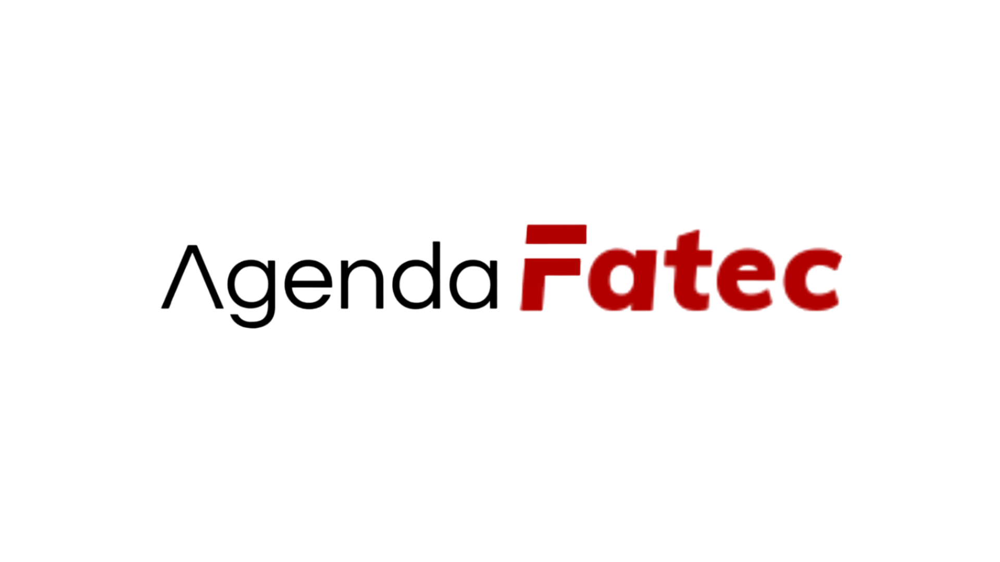

# Agenda Fatec | Apresentação Pública

## Introdução

O Agenda Fatec surgiu como um projeto proposto pela Fatec Jahu (SP), cujo objetivo é auxiliar o gerenciamento e agendamento de suas salas por parte das pessoas que frequentam a instituição.

## Equipe de Desenvolvimento

- [Deivide Benedito](https://github.com/DeivideBS);
- [Pablo Valentin](https://github.com/PabloValentin94);
- [Pedro Lucatto](https://github.com/Pedro-Lucatto);
- [Thiago Figueredo](https://github.com/thiagofjau).

## Documentação

Para encontrar toda a documentação desenvolvida até o momento, [clique aqui](https://github.com/Agenda-Fatec/Documentos).

## Contato

Caso possua alguma dúvida ou sugestão pertinente ao desenvolvimento do projeto, entre em contato pelo e-mail [pablo.valentin@fatec.sp.gov.br](mailto:pablo.valentin@fatec.sp.gov.br).